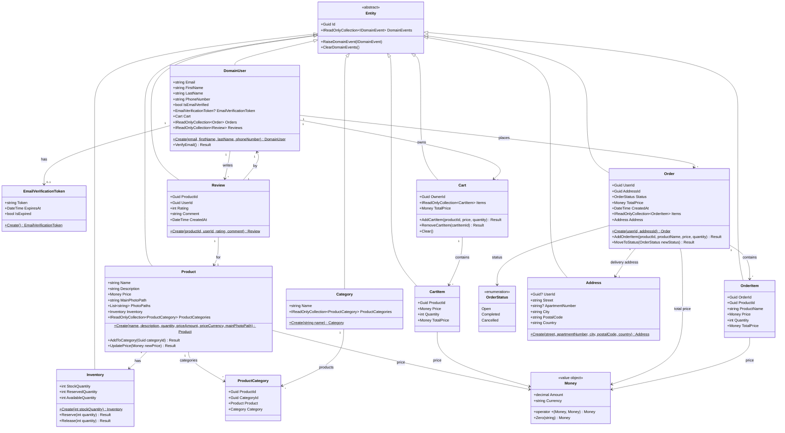

# SharpBuy Domain Model

## Class Diagram

## Aggregate Roots

### Product Aggregate
- **Root**: Product
- **Entities**: Inventory, ProductCategory
- **Value Objects**: Money
- **Purpose**: Manages product catalog with inventory and categorization

### User Aggregate
- **Root**: DomainUser (User)
- **Entities**: EmailVerificationToken
- **Purpose**: User registration, authentication, and email verification

### Cart Aggregate
- **Root**: Cart
- **Entities**: CartItem
- **Value Objects**: Money
- **Purpose**: Shopping cart management before order placement

### Order Aggregate
- **Root**: Order
- **Entities**: OrderItem, Address
- **Value Objects**: Money, OrderStatus
- **Purpose**: Order processing and fulfillment

### Review Aggregate
- **Root**: Review
- **Purpose**: Product reviews and ratings

### Category Aggregate
- **Root**: Category
- **Entities**: ProductCategory (join entity)
- **Purpose**: Product categorization (many-to-many with Product)

## Key Design Patterns

### Entity Base Class
All domain entities inherit from `Entity` base class which provides:
- Unique identifier (`Guid Id`)
- Domain event collection and management
- Common entity behavior

### Value Objects
- **Money**: Immutable value object with amount and currency
- Supports arithmetic operations with currency validation
- Prevents mixing different currencies

### Factory Methods
All aggregates use static factory methods (e.g., `Create()`) for instantiation:
- Ensures valid initial state
- Encapsulates business rules
- Private constructors for EF Core

### Domain Events
Entities can raise domain events for cross-aggregate communication:
- `UserRegisteredDomainEvent`: Triggered when user registers
- `ProductPriceChangedDomainEvent`: Triggered on price updates
- Events published in `SaveChangesAsync` (transactional consistency)

## Relationships

### One-to-One
- Product ↔ Inventory
- DomainUser ↔ Cart
- Order → Address

### One-to-Many
- DomainUser → Orders
- DomainUser → Reviews
- Cart → CartItems
- Order → OrderItems
- Product → Reviews

### Many-to-Many
- Product ↔ Category (via ProductCategory join entity)

## Business Rules

### Product
- Price must be greater than zero
- Cannot change currency after creation
- Must belong to at least one category

### Cart
- Cannot add items with insufficient inventory
- Each cart item tracks product price at time of addition
- Total price calculated from all items

### Order
- Can only transition through valid status changes: Open → Completed/Cancelled
- Total price calculated from all order items
- Requires valid delivery address

### Inventory
- Stock quantity cannot be negative
- Reserved quantity tracks pending orders
- Available quantity = Stock - Reserved

### Review
- Rating must be between 1 and 5
- User can only review products once
- Cannot review products not purchased

## Database Schema Naming

- **Convention**: snake_case (via EFCore.NamingConventions)
- **Tables**: `products`, `categories`, `orders`, `carts`, etc.
- **Columns**: `product_id`, `created_at`, `price_amount`, etc.
- **Foreign Keys**: `FK_{Table}_{ReferencedTable}_{Column}`
- **Indexes**: Automatically generated on foreign keys and specified properties
